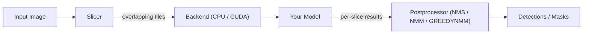

# sahi.rs

A high-performance Rust implementation of [SAHI (Slicing Aided Hyper Inference)](https://github.com/obss/sahi) for improved small-object detection — and instance segmentation — through image slicing.

## Capabilities

- **Detection and instance segmentation** — `Sahi::predict` returns boxes; `Sahi::predict_instances` returns boxes with masks.
- **Model-agnostic** — bring any detector or segmenter via a callback.
- **Postprocessing** — NMS, NMM, and GREEDYNMM, with IoU or IoS matching (masks are unioned when boxes merge).
- **CPU and GPU backends** — sequential, multi-threaded (the `parallel` feature, via rayon), or CUDA slice extraction.
- **Built-in YOLOv8** — optional ONNX Runtime detector (CPU / CUDA / TensorRT execution providers).
- **Python bindings** — native `sahi_rs` module via PyO3, accepting numpy arrays.



## Quick Start

```rust
use sahi::{Sahi, ImageData, callback};

let sahi = Sahi::builder()
    .slice_size(640, 640)
    .overlap(0.2, 0.2)
    .build();

let model = callback(|img: &ImageData| {
    // Your model inference here
    Ok(vec![])
});

let detections = sahi.predict(&image, &model)?;
```

For instance segmentation, return masks from a `SegmentationCallback` and call
`sahi.predict_instances(&image, &seg_model)?` to get `MaskedDetection`s (boxes + masks)
in image coordinates.

## Documentation

Detailed documentation is available in the [Wiki](../../wiki):

- **[Architecture](../../wiki/Architecture)** — pipeline design, module map, backend architecture, data flow diagrams
- **[NMS Algorithms](../../wiki/NMS-Algorithms)** — Non-Maximum Suppression variants (NMS, NMM, GREEDYNMM) with visual illustrations
- **[Getting Started](../../wiki/Getting-Started)** — installation, build commands, feature flags, examples
- **[Configuration](../../wiki/Configuration)** — all configuration options and tuning guidance
- **[Python Integration](../../wiki/Python-Integration)** — PyO3 bindings, maturin setup, Python usage
- **[API Reference](../../wiki/API-Reference)** — key types, method signatures, format conversions

## Features

| Feature | Description |
|---------|-------------|
| `parallel` | CPU parallelism via rayon (multi-threaded slice extraction) |
| `cuda` | GPU slice extraction via cudarc |
| `python` | PyO3 Python bindings |
| `onnx` | ONNX Runtime model inference |
| `models` | `onnx` + image processing (built-in YOLOv8) |
| `models-cuda` | CUDA-accelerated ONNX |

```bash
cargo check                       # CPU only
cargo check --features parallel   # With CPU parallelism
cargo check --features cuda       # With CUDA
cargo test                        # Run tests
```

## License

MIT
