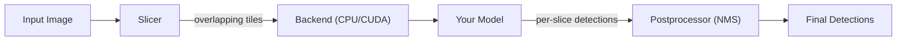

# sahi.rs

A high-performance Rust implementation of [SAHI (Slicing Aided Hyper Inference)](https://github.com/obss/sahi) for improved small object detection through image slicing.



## Quick Start

```rust
use sahi::{Sahi, ImageData, callback};

let sahi = Sahi::builder()
    .slice_size(640, 640)
    .overlap(0.2, 0.2)
    .build();

let model = callback(|img: &ImageData| {
    // Your model inference here
    Ok(vec![])
});

let detections = sahi.predict(&image, &model)?;
```

## Documentation

Detailed documentation is available in the [Wiki](../../wiki):

- **[Architecture](../../wiki/Architecture)** — pipeline design, module map, backend architecture, data flow diagrams
- **[NMS Algorithms](../../wiki/NMS-Algorithms)** — Non-Maximum Suppression variants (NMS, NMM, GREEDYNMM) with visual illustrations
- **[Getting Started](../../wiki/Getting-Started)** — installation, build commands, feature flags, examples
- **[Configuration](../../wiki/Configuration)** — all configuration options and tuning guidance
- **[Python Integration](../../wiki/Python-Integration)** — PyO3 bindings, maturin setup, Python usage
- **[API Reference](../../wiki/API-Reference)** — key types, method signatures, format conversions

## Features

| Feature | Description |
|---------|-------------|
| `cuda` | GPU acceleration via cudarc |
| `python` | PyO3 Python bindings |
| `onnx` | ONNX Runtime model inference |
| `models` | `onnx` + image processing |
| `models-cuda` | CUDA-accelerated ONNX |

```bash
cargo check                    # CPU only
cargo check --features cuda    # With CUDA
cargo test                     # Run tests
```

## License

MIT
