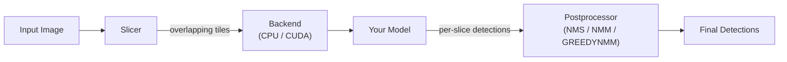

# sahi.rs

[](https://github.com/danghoangnhan/sahi.rs/actions/workflows/ci.yml)
[](https://opensource.org/licenses/MIT)

A high-performance Rust implementation of [SAHI (Slicing Aided Hyper Inference)](https://github.com/obss/sahi) for improved small object detection through image slicing.

Standard object detectors resize inputs to fixed dimensions (e.g., 640x640), causing small objects to shrink and become undetectable. sahi.rs solves this by slicing images into overlapping tiles, running inference on each tile at full resolution, and merging results with configurable postprocessing.



## Highlights

- **Model-agnostic** -- bring any detector via callbacks (YOLO, DETR, custom models)
- **CPU & GPU backends** -- sequential, parallel (rayon), or CUDA with multi-stream pipelining
- **Three postprocessing algorithms** -- NMS, NMM, GREEDYNMM with IoU/IoS metrics
- **Python bindings** -- native `sahi_rs` module via PyO3, accepts numpy arrays
- **Built-in YOLOv8** -- ONNX Runtime integration with CPU/CUDA/TensorRT execution providers
- **Zero-copy design** -- reusable buffers, batch inference, minimal allocations

## Installation

### Rust

```toml
[dependencies]
sahi = "0.1"

# With CPU parallelism
sahi = { version = "0.1", features = ["parallel"] }

# With CUDA acceleration
sahi = { version = "0.1", features = ["cuda"] }

# With built-in YOLOv8 detector
sahi = { version = "0.1", features = ["models"] }
```

### Python

```bash
pip install sahi-rs

# From source with ONNX support
pip install maturin && maturin develop --features python,models

# From source with CUDA
maturin develop --features python,models-cuda
```

## Quick Start

### Rust

```rust
use sahi::{Sahi, ImageData, Detection, BoundingBox, callback};

fn main() -> sahi::Result<()> {
    let sahi = Sahi::builder()
        .slice_size(640, 640)
        .overlap(0.2, 0.2)
        .confidence_threshold(0.25)
        .build();

    let model = callback(|img: &ImageData| {
        // Your model inference here
        Ok(vec![Detection::new(
            BoundingBox::new(100.0, 100.0, 50.0, 50.0),
            0, 0.85, Some("person".to_string()),
        )])
    });

    let image = ImageData::from_rgb(vec![0u8; 1920 * 1080 * 3], 1920, 1080);
    let detections = sahi.predict(&image, &model)?;

    for det in &detections {
        println!("{}: {:.2} at ({:.0}, {:.0}, {:.0}, {:.0})",
            det.class_name.as_deref().unwrap_or("?"),
            det.confidence,
            det.bbox.x, det.bbox.y, det.bbox.width, det.bbox.height);
    }
    Ok(())
}
```

### Python

```python
import numpy as np
from sahi_rs import Sahi, Detection, BoundingBox

def my_detector(image: np.ndarray) -> list[Detection]:
    # image is (H, W, C) uint8 RGB — your model inference here
    return [Detection(
        bbox=BoundingBox(x=100.0, y=100.0, width=50.0, height=50.0),
        class_id=0, confidence=0.85, class_name="person"
    )]

sahi = Sahi(slice_width=640, slice_height=640)
image = np.zeros((1080, 1920, 3), dtype=np.uint8)
detections = sahi.predict(image, my_detector)

for det in detections:
    print(f"{det.class_name}: {det.confidence:.2f}")
```

## Features

| Feature | Description |
|---------|-------------|
| `parallel` | CPU parallelism via rayon (multi-threaded slice extraction) |
| `cuda` | GPU acceleration via cudarc (CUDA kernel slice extraction, multi-stream) |
| `python` | PyO3 Python bindings |
| `onnx` | ONNX Runtime for model inference (CPU) |
| `onnx-cuda` | ONNX Runtime with CUDA execution provider |
| `onnx-tensorrt` | ONNX Runtime with TensorRT execution provider |
| `models` | `onnx` + image processing (built-in YOLOv8 detector) |
| `models-cuda` | `models` + CUDA inference |
| `models-tensorrt` | `models` + TensorRT inference |

## Build & Test

```bash
cargo check                            # CPU only
cargo check --features parallel        # With CPU parallelism
cargo check --features cuda            # With CUDA
cargo test                             # Run tests
cargo bench                            # Run benchmarks
cargo run --example basic              # Run example
```

## Documentation

Detailed documentation is available in the **[Wiki](../../wiki)**:

| Page | Description |
|------|-------------|
| **[Architecture](../../wiki/Architecture)** | Pipeline design, module map, backend architecture, data flow |
| **[NMS Algorithms](../../wiki/NMS-Algorithms)** | NMS, NMM, GREEDYNMM with visual step-by-step illustrations |
| **[Getting Started](../../wiki/Getting-Started)** | Installation, build commands, feature flags, first example |
| **[Configuration](../../wiki/Configuration)** | All parameters with tuning guidance |
| **[Python Integration](../../wiki/Python-Integration)** | PyO3 bindings, maturin setup, Python API |
| **[API Reference](../../wiki/API-Reference)** | Types, method signatures, format conversions |
| **[Edge Deployment](../../wiki/Edge-Deployment)** | TensorRT, Jetson, quantization, edge-cloud architectures |

## License

MIT
